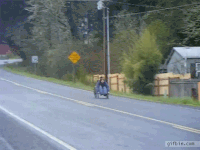

### Olá, Eu sou o Kaio Victor! ✋

## Um pouco sobre mim

  

    <ul>
      <li>Sou um desenvolvedor fullstack, amante da música, tocando alguns instrumentos, como: Trombone de vara, violão, harmônica, flauta doce e teclado. 🎶</li>
      <li>Gosto de dizer que uma das minhas maiores experiências foi o FUNDO DO POÇO, um momento difícil aos 17 anos, sofrendo uma lesão medular que transformou completamente minha trajetória. Nesse período, precisei me reinventar, aprender novamente o básico de viver e me readaptar como pessoa. Meu sonho inicial de ser Policial Federal teve que ser deixado para trás, mas encontrei novos caminhos. Hoje, estou dedicado ao que amo, a tecnologia, que se tornou uma luz nos dias sombrios deitado em uma cama sem saber o que seria da minha vida profissional. Estou constantemente buscando aprender mais e melhorar, enfrentando desafios e aproveitando as oportunidades que a vida me apresenta, pois vencer desafios se tornou rotina em minha vida e quero levar isso para minha vida profissional.👨‍🦽💨🔱</li>
    </ul>
  

  

    
  

## Tecnologias que eu uso no meu dia

 

 

  
<b>⚡ Github Stats</b>

   
  
  

  
<b>☄️ Github Streaks</b>

   
  

## Tento ser melhor do que ontem!
